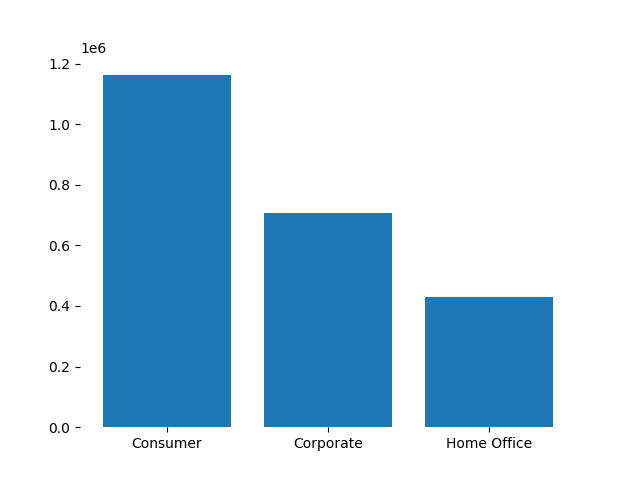
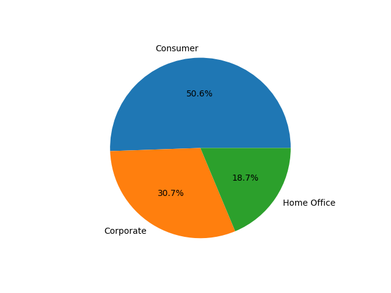
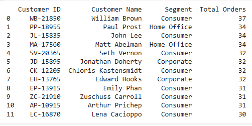
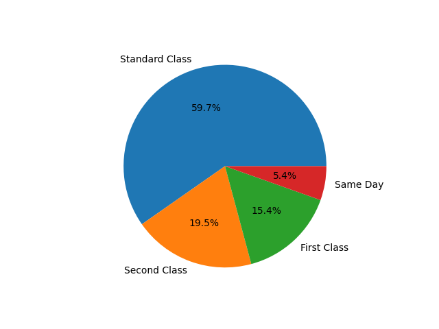
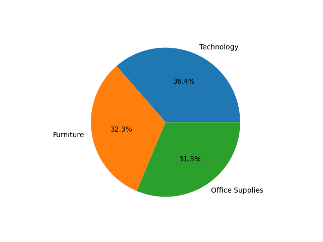
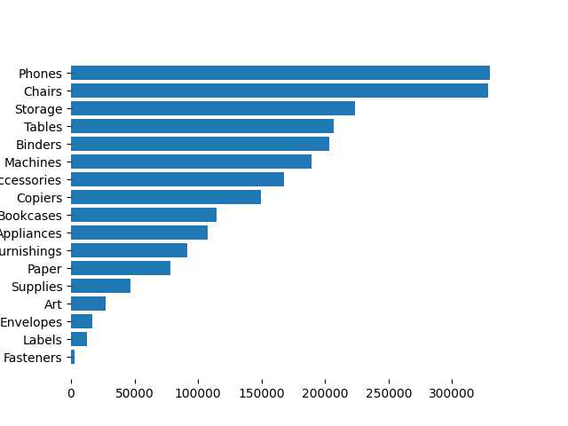
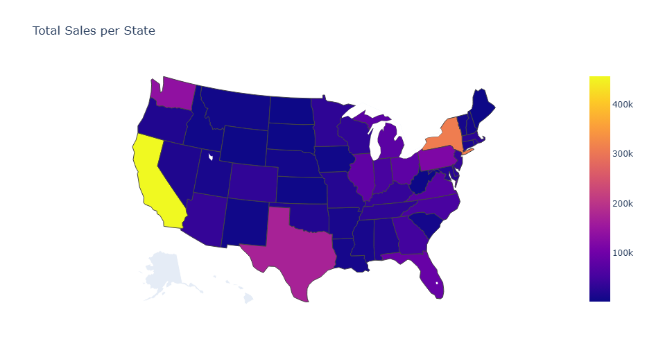

# Introduction
Dive into Superstore Sales data, to provide suggestions and recommendations for Customer Sales insights, Exploring Customer Loyalty at Superstores, Superstore Shipping Strategies,  Geographic Market Analysis and Product Performance Insights. Also, to provide Comprehensive Sales Analysis.

# The Analysis
1-Superstore Customer Segmentation


2-Customer Sales insights (Total Sales)



3- Number of sales per type of customer



4- Exploring Customer Loyalty at Superstores (Total Orders)

```
customers_order_frequency = df.groupby(['Customer ID', 'Customer Name', 'Segment'])['Order ID'].count().reset_index()
customers_order_frequency.rename(columns={'Order ID' : 'Total Orders'}, inplace = True)
repeat_customers = customers_order_frequency[customers_order_frequency['Total Orders'] >= 1]
repeat_customers_sorted = repeat_customers.sort_values(by='Total Orders', ascending = False)
print(repeat_customers_sorted.head(12).reset_index(drop=True))
```



5- Customer Loyalty at Superstores by (Total Sales)


The table for total sales shows that customer with higher sales not necessary have the highest orders.

6- Superstore Shipping Strategies



7- Product Performance Insights
```
subcategory_count_sales = df.groupby(['Category', 'Sub-Category'])['Sales'].sum().reset_index()
subcategory_count_sales = subcategory_count_sales.sort_values(by='Sales', ascending = False)
```



Total sales for top product category



The graph shows that phones, chairs and storage are achieving the highest sales we can drive more marketing resources on the top categories.

8. Visualizing Sales by State

```
import plotly.graph_objects as go
from plotly.subplots import make_subplots
import plotly.io as pio

fig  = go.Figure(data=go.Choropleth( 
    locations = sum_of_sales['State_Abbreviation'],
    locationmode = 'USA-states',
    z = sum_of_sales['Sales'],
    hoverinfo = 'location+z',
    showscale = True))
fig.update_geos(projection_type = 'albers usa')
fig.update_layout(
    geo_scope = 'usa',
    title_text = 'Total Sales per State')
fig.show()
```



